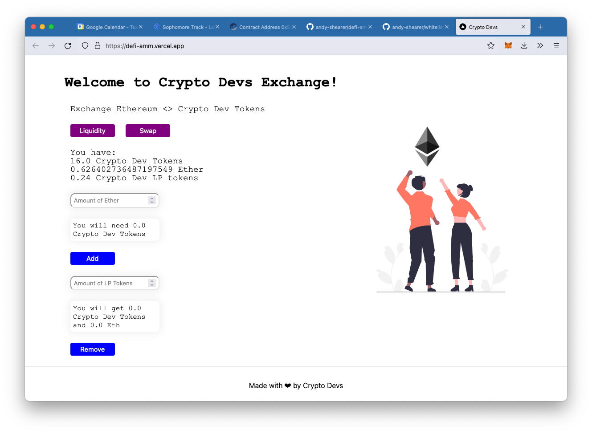

# Decentralised Finance - Automated Market Maker Project (DeFi-AMM)
This is the final (and largest) project in the [LearnWeb3DAO Sophmore track](https://www.learnweb3.io/tracks/sophomore); to create the smart
contract and front-end for a DeFi exchange. This project builds upon the functionality
from [andy-shearer/initial-coin-offering](https://github.com/andy-shearer/initial-coin-offering) and allows owners of the CryptoDevs
token to provide liquidity for an ETH <> CD Token swap.

Liquidity providers can define the initial ratio of the swap if there is no liquidity,
and receive an ERC-20 Liquidity Pool token ([view on Etherscan](https://rinkeby.etherscan.io/token/0x5a662f00D7A1A102F45304592bBcFA8bec2d28f1))
which can be used at any point in the future to withdraw their tokens & ETH from the exchange.

This project was built using hardhat and next.js - see both README files in the relevant subdirectories 
([hardhat](./hardhat/README.md) / [next.js](./my-app/README.md))

Deployed to: https://defi-amm.vercel.app/ on the Rinkeby testnet:

